<div align="center">

<!-- ══════════════════════════════════════════════════════════ -->
<!--              CLEAN STATIC HEADER                          -->
<!-- ══════════════════════════════════════════════════════════ -->

<!-- Top line -->


<br/>


<!-- Holographic glitch scan lines -->

<!-- Advanced typing matrix -->


<br/>

<!-- Live status grid -->

<tr>
<td align="center">

</td>
</tr>
</table>

<br/>

<!-- Advanced badges with glow -->
<p>
 
  &nbsp;
  
  &nbsp;
  
  

</p>

<br/>

<!-- Live metrics with actual data -->
<p>
  
  &nbsp;
  
 
</p>

<!-- Bottom scan line -->

</div>

<br/>

---
<!-- ══════════════════════════════════════════════════════════ -->
<!--                  ANIMATED INTRO                           -->
<!-- ══════════════════════════════════════════════════════════ -->

<div align="center">


</div>


---

<br/>

<!-- ══════════════════════════════════════════════════════════ -->
<!--              IDENTITY + PROCESS MONITOR                   -->
<!-- ══════════════════════════════════════════════════════════ -->

<table width="100%">
<tr>
<td width="50%" valign="top">

```typescript
class FullStackArchitect {
  name = "Ahmad Malik";
  title = "Full-Stack Developer & AI Engineer";
  location = "Pakistan";

  expertise = {
    languages: ["Python", "TypeScript", "JavaScript", "Java", "C++"],
    backend: ["Node.js", "FastAPI", "Python", "Playwright"],
    frontend: ["React", "Tailwind CSS", "Vite", "HTML5/CSS3"],
    databases: ["MongoDB", "Firebase", "SQL", "Oracle"],
    cloud: ["Google Cloud", "AWS", "Docker"],
    tools: ["Git", "WSL 2", "n8n", "BeautifulSoup4"]
  };

  specialties = [
    "AI/LLM Integration",
    "Full-Stack Web Applications", 
    "Browser Automation",
    "VS Code Extensions"
  ];

  currentlyBuilding = "AI-Powered Development Tools & Automation Systems";
}
```
</td> <td width="50%" valign="middle"><div align="center"></div></td> </tr> </table>
<br/>

---

<br/>

<!-- ══════════════════════════════════════════════════════════ -->
<!--      SKILL HISTOGRAM                                      -->
<!-- ══════════════════════════════════════════════════════════ -->

<div align="center">

## ◈ SKILL PROFICIENCY MATRIX ◈

<sub>▸ SCANNING SKILL DATABASE... ALL MODULES LOADED ✓</sub>


<br/>

<!-- ✅ FIXED: skill-histogram.svg (not histogram.svg) -->


<br/>


&nbsp;

&nbsp;


</div>

<br/>

---

<br/>

<!-- ══════════════════════════════════════════════════════════ -->
<!--     LANGUAGE DISTRIBUTION                                 -->
<!-- ══════════════════════════════════════════════════════════ -->

<div align="center">

## ◈ LANGUAGE DISTRIBUTION ◈


<br/>

<!-- ✅ FIXED: lang-donut.svg (not donut.svg) -->


</div>

<br/>

---

<br/>

<!-- ══════════════════════════════════════════════════════════ -->
<!--          30-DAY ACTIVITY BARS                             -->
<!-- ══════════════════════════════════════════════════════════ -->

<div align="center">

## ◈ 30-DAY COMMIT ACTIVITY ◈


<br/>

<!-- ✅ activity-bars.svg in assets folder -->


</div>

<br/>

---

<br/>

<!-- ══════════════════════════════════════════════════════════ -->
<!--                    TECH ARSENAL                           -->
<!-- ══════════════════════════════════════════════════════════ -->

<div align="center">

## ◈ TECH ARSENAL ◈

</div>

<details open>
<summary align="center"><b>Languages & Core</b></summary>
<br/>
<p align="center">
  
</p>
</details>

<br/>

<details>
<summary align="center"><b>Backend & APIs</b></summary>
<br/>
<p align="center">
  
  <br/><br/>
  
  &nbsp;
  
  &nbsp;
  
</p>
</details>

<br/>

<details>
<summary align="center"><b>Frontend & UI</b></summary>
<br/>
<p align="center">
  
  <br/><br/>
  
</p>
</details>

<br/>

<details>
<summary align="center"><b>Databases</b></summary>
<br/>
<p align="center">
  
  <br/><br/>
  
</p>
</details>

<br/>

<details>
<summary align="center"><b>Cloud & DevOps</b></summary>
<br/>
<p align="center">
  
  <br/><br/>
  
  &nbsp;
  
</p>
</details>

<br/>

---

<br/>

<!-- ══════════════════════════════════════════════════════════ -->
<!--                   SYSTEM METRICS                          -->
<!-- ══════════════════════════════════════════════════════════ -->

<div align="center">

## ◈ SYSTEM METRICS ◈


<br/>


&nbsp;&nbsp;


<br/><br/>


</div>

<br/>

---

<br/>

<!-- ══════════════════════════════════════════════════════════ -->
<!--                 DEPLOYMENT HISTORY                        -->
<!-- ══════════════════════════════════════════════════════════ -->

<div align="center">

## ◈ DEPLOYMENT HISTORY ◈


<br/>


</div>

<br/>

---

<br/>

<!-- ══════════════════════════════════════════════════════════ -->
<!--                  ACHIEVEMENT NODES                        -->
<!-- ══════════════════════════════════════════════════════════ -->

<div align="center">

## ◈ ACHIEVEMENT NODES ◈


<br/>


</div>

<br/>

---

<br/>

<!-- ══════════════════════════════════════════════════════════ -->
<!--                 DEPLOYMENT CATALOG                        -->
<!-- ══════════════════════════════════════════════════════════ -->

<div align="center">

## ◈ DEPLOYMENT CATALOG ◈


<br/>

<table>
  <tr>
    <td align="center" width="31%">
      <br/>
      
      <br/><br/>
      <strong>AI Detection Engine</strong>
      <br/><br/>
      <code>Python · LLM Vision · Voting Algo</code>
      <br/><br/>
      <sub>Hybrid rule-based heuristics with ensemble model architecture</sub>
      <br/><br/>
     <sub>MODULE_01</sub>
      <br/><br/>
    </td>
    <td align="center" width="31%">
      <br/>
      
      <br/><br/>
      <strong>Full-Stack Platforms</strong>
      <br/><br/>
      <code>React · FastAPI · MongoDB · Cloud</code>
      <br/><br/>
      <sub>Cloud-native architecture with real-time data pipelines</sub>
      <br/><br/>
     <sub>MODULE_02</sub>
      <br/><br/>
    </td>
    <td align="center" width="31%">
      <br/>
      
      <br/><br/>
      <strong>VS Code Extensions</strong>
      <br/><br/>
      <code>TypeScript · Canvas API · Diagnostics</code>
      <br/><br/>
      <sub>Custom rendering engine with real-time code intelligence</sub>
      <br/><br/>
      <sub>MODULE_03</sub>
      <br/><br/>
    </td>
  </tr>
  <tr><td colspan="3"><br/></td></tr>
  <tr>
    <td align="center" width="31%">
      <br/>
      
      <br/><br/>
      <strong>Browser Automation</strong>
      <br/><br/>
      <code>Playwright · BS4 · Node.js</code>
      <br/><br/>
      <sub>Lazy-load handling with intelligent data extraction</sub>
      <br/><br/>
   <sub>MODULE_04</sub>
      <br/><br/>
    </td>
    <td align="center" width="31%">
      <br/>
      
      <br/><br/>
      <strong>Data Systems</strong>
      <br/><br/>
      <code>Firebase · MongoDB · SQL · Oracle</code>
      <br/><br/>
      <sub>Multi-database architecture with live cross-sync pipelines</sub>
      <br/><br/>
     <sub>MODULE_05</sub>
      <br/><br/>
    </td>
    <td align="center" width="31%">
      <br/>
      
      <br/><br/>
      <strong>Cloud Deployments</strong>
      <br/><br/>
      <code>GCP · AWS · Docker · CI/CD</code>
      <br/><br/>
      <sub>Containerized solutions with fully automated workflows</sub>
      <br/><br/>
     <sub>MODULE_06</sub>
      <br/><br/>
    </td>
  </tr>
</table>

</div>

<br/>

---

<br/>
<!-- ══════════════════════════════════════════════════════════ -->
<!--              NEURAL PULSE NETWORK                         -->
<!-- ══════════════════════════════════════════════════════════ -->

<div align="center">

## ◈ PACMAN NETWORK ◈


<br/>


</div>

<br/>

---

<br/>
<!-- ══════════════════════════════════════════════════════════ -->
<!--                    CORE DIRECTIVE                         -->
<!-- ══════════════════════════════════════════════════════════ -->

<div align="center">

## ◈ CORE DIRECTIVE ◈

<br/>


<br/>

*— Ahmad Malik &nbsp;`⟁ Engineer · Builder · Architect`*

<br/><br/>


</div>

<br/>

---

<br/>

<!-- ══════════════════════════════════════════════════════════ -->
<!--                     OPEN CHANNEL                          -->
<!-- ══════════════════════════════════════════════════════════ -->

<div align="center">

## ◈ OPEN CHANNEL ◈


<br/><br/>

[](mailto:ahmadmalik1376@gmail.com)
&nbsp;
[](https://github.com/AHMADMALIK1376)
&nbsp;
[](#)

<br/><br/>


</div>

<!-- FOOTER -->

