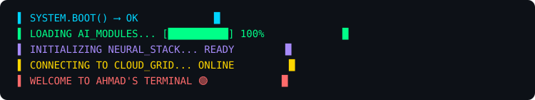
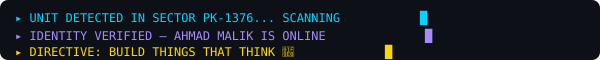
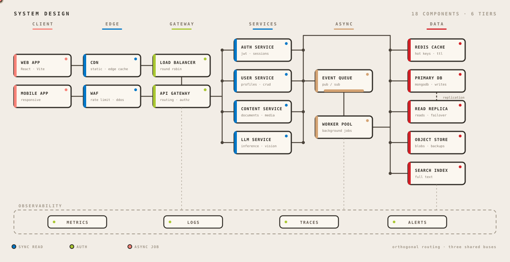
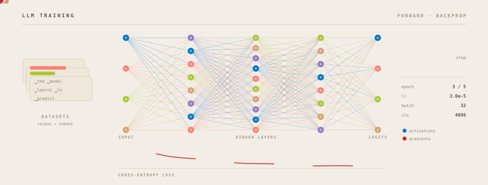
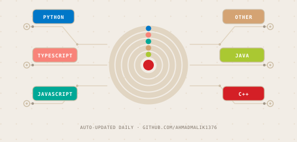
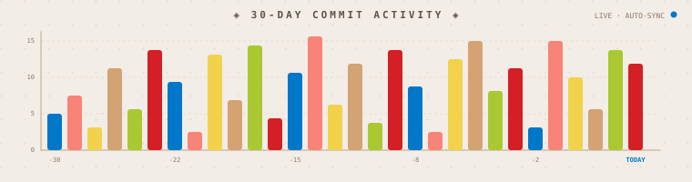
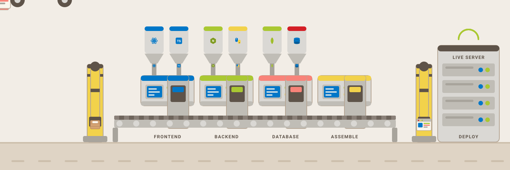

<!-- ══════════════════════════════════════════════════════════ -->
<!--              INTRODUCTION                                 -->
<!-- ══════════════════════════════════════════════════════════ -->

 

 

 

<!-- Advanced badges with glow -->

 
  &nbsp;
  
  &nbsp;
  
  

 

  &nbsp;
  
 

 

---
<!-- ══════════════════════════════════════════════════════════ -->
<!--                  ANIMATED INTRO                           -->
<!-- ══════════════════════════════════════════════════════════ -->

---

 

<!-- ══════════════════════════════════════════════════════════ -->
<!--              SYSTEM DESIGN                                 -->
<!-- ══════════════════════════════════════════════════════════ -->

## ◈ SYSTEM DESIGN ◈

▸ CLIENT → CDN → GATEWAY → SERVICES → DATA ✓

 

 

---

 

<!-- ══════════════════════════════════════════════════════════ -->
<!--      LLM TRAINING                                         -->
<!-- ══════════════════════════════════════════════════════════ -->

## ◈ LLM TRAINING ◈

▸ DATASETS → FORWARD PASS → BACKPROP ✓

 

 

&nbsp;

&nbsp;

 

---

 

<!-- ══════════════════════════════════════════════════════════ -->
<!--     LANGUAGE DISTRIBUTION                                 -->
<!-- ══════════════════════════════════════════════════════════ -->

## ◈ LANGUAGE DISTRIBUTION ◈

▸ SCANNING REPO LANGUAGE BYTES... CHART RENDERING 📊

 

<!-- ✅ FIXED: lang-donut.svg (not donut.svg) -->

 

---

 

<!-- ══════════════════════════════════════════════════════════ -->
<!--          30-DAY ACTIVITY BARS                             -->
<!-- ══════════════════════════════════════════════════════════ -->

## ◈ 30-DAY COMMIT ACTIVITY ◈

▸ READING COMMIT LOGS... GRAPH RENDERING 📊

 

<!-- ✅ activity-bars.svg in assets folder -->

 

---

 

<!-- ══════════════════════════════════════════════════════════ -->
<!--                    TECH ARSENAL                           -->
<!-- ══════════════════════════════════════════════════════════ -->

## ◈ TECH ARSENAL ◈

<b>Languages & Core</b>

 

  

 

<b>Backend & APIs</b>

 

  
    
  
  &nbsp;
  
  &nbsp;
  

 

<b>Frontend & UI</b>

 

  
    
  

 

<b>Databases</b>

 

  
    
  

 

<b>Cloud & DevOps</b>

 

  
    
  
  &nbsp;
  

 

---

 

<!-- ══════════════════════════════════════════════════════════ -->
<!--                   SYSTEM METRICS                          -->
<!-- ══════════════════════════════════════════════════════════ -->

## ◈ SYSTEM METRICS ◈

▸ PULLING LIVE TELEMETRY... DATA STREAM OPEN 📡

 

&nbsp;&nbsp;

  

 

---

 

<!-- ══════════════════════════════════════════════════════════ -->
<!--                 DEPLOYMENT HISTORY                        -->
<!-- ══════════════════════════════════════════════════════════ -->

## ◈ DEPLOYMENT HISTORY ◈

 

 

---

 

<!-- ══════════════════════════════════════════════════════════ -->
<!--                  ACHIEVEMENT NODES                        -->
<!-- ══════════════════════════════════════════════════════════ -->

## ◈ ACHIEVEMENT NODES ◈

▸ SCANNING TROPHY VAULT... ACHIEVEMENTS UNLOCKED 🏆

 

 

---

 

<!-- ══════════════════════════════════════════════════════════ -->
<!--              BUILD & DEPLOY PIPELINE                      -->
<!-- ══════════════════════════════════════════════════════════ -->

## ◈ BUILD & DEPLOY PIPELINE ◈

 

 

---

 
<!-- ══════════════════════════════════════════════════════════ -->
<!--                    CORE DIRECTIVE                         -->
<!-- ══════════════════════════════════════════════════════════ -->

## ◈ CORE DIRECTIVE ◈

 

### “Automate the boring. Architect the complex. Ship the impossible.”

 

*— Ahmad Malik &nbsp;`⟁ Engineer · Builder · Architect`*

  

 

---

 

<!-- ══════════════════════════════════════════════════════════ -->
<!--                     OPEN CHANNEL                          -->
<!-- ══════════════════════════════════════════════════════════ -->

## ◈ OPEN CHANNEL ◈

▸ OPENING COMMS CHANNEL... ENCRYPTION ON 🔐 &nbsp;·&nbsp; CHANNEL OPEN — SEND YOUR SIGNAL 📡

  

&nbsp;

  

TRANSMISSION COMPLETE. AWAITING YOUR SIGNAL... 📡 &nbsp;·&nbsp; LET’S BUILD SOMETHING THE WORLD HASN’T SEEN. 👾 &nbsp;·&nbsp; SYSTEM STANDING BY... 🟢

<!-- FOOTER -->

