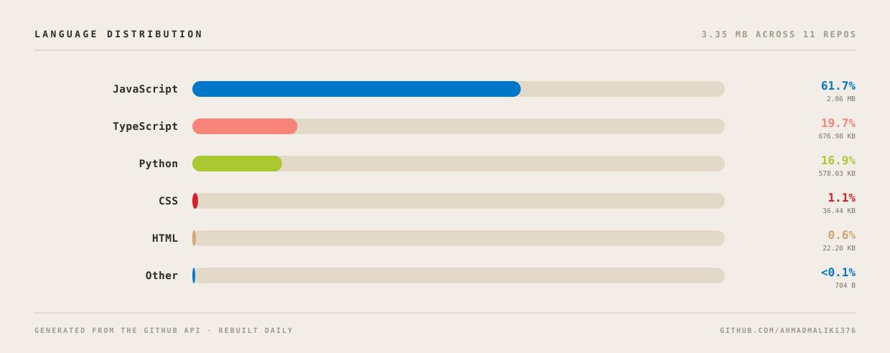

<!-- ══════════════════════════════════════════════════════════ -->
<!--               INTRODUCTION                                 -->
<!-- ══════════════════════════════════════════════════════════ -->

 

 

<!-- ══════════════════════════════════════════════════════════ -->
<!--               SYSTEM DESIGN                                -->
<!-- ══════════════════════════════════════════════════════════ -->

 

---
<!-- ══════════════════════════════════════════════════════════ -->
<!--      LLM TRAINING                                          -->
<!-- ══════════════════════════════════════════════════════════ -->

 

 

---
<!-- ══════════════════════════════════════════════════════════ -->
<!--      LANGUAGE DISTRIBUTION                                 -->
<!-- ══════════════════════════════════════════════════════════ -->

 

---
<!-- ══════════════════════════════════════════════════════════ -->
<!--          30-DAY ACTIVITY BARS                              -->
<!-- ══════════════════════════════════════════════════════════ -->

 

---
<!-- ══════════════════════════════════════════════════════════ -->
<!--                    TECH ARSENAL                            -->
<!-- ══════════════════════════════════════════════════════════ -->

<b>Languages & Core</b>

 

  

 

<b>Backend & APIs</b>

 

  
    
  
  &nbsp;
  
  &nbsp;
  

 

<b>Frontend & UI</b>

 

  
    
  

 

<b>Databases</b>

 

  
    
  

 

<b>Cloud & DevOps</b>

 

  
    
  
  &nbsp;
  

---
<!-- ══════════════════════════════════════════════════════════ -->
<!--                    SYSTEM METRICS                          -->
<!-- ══════════════════════════════════════════════════════════ -->

 

---
<!-- ══════════════════════════════════════════════════════════ -->
<!--              BUILD & DEPLOY PIPELINE                       -->
<!-- ══════════════════════════════════════════════════════════ -->

 

---
<!-- ══════════════════════════════════════════════════════════ -->
<!--                      OPEN CHANNEL                          -->
<!-- ══════════════════════════════════════════════════════════ -->

  

&nbsp;

  

TRANSMISSION COMPLETE. AWAITING YOUR SIGNAL... 📡 &nbsp;·&nbsp; LET’S BUILD SOMETHING THE WORLD HASN’T SEEN. 👾 &nbsp;·&nbsp; SYSTEM STANDING BY... 🟢

<!-- FOOTER -->

